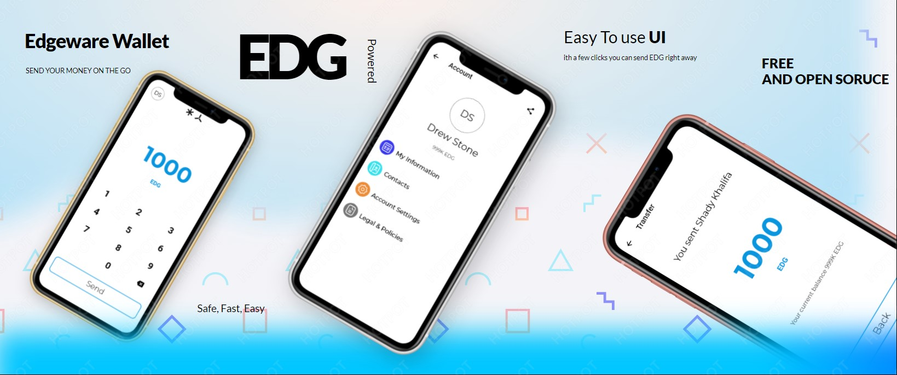

# Edgeware Wallet (Demo)

<!-- TODO(shekohex): add CI Tags here once done with CI/CD -->

<div align="center">
  
</div>

<div align="center">
  <sub>
      ⚠ Still Under Constructions ⚠.
  </sub>
</div>

This project uses [cargo make](https://github.com/sagiegurari/cargo-make) to combine the build commands for compiling the Rust `edgeware-wallet` module and linking it to the Flutter interface. This structure will eventually enable our substrate RPC client to talk directly to the Flutter interface (with no dependency on polkadot.js).

[`shekohex/flutterust`](https://github.com/shekohex/flutterust) is a generic template for Rust to Dart FFI

## Features

-   [x] Generate a new Edgeware Account.
-   [x] Backup/Restore your account using `Paper Key` (Seed Phrase).
-   [ ] Transfer `EDG` to your contacts.
-   [x] Keep track of your contacts (view balances, share contacts).
-   [x] Share your account using QR Code and add contacts by scanning the QR Code.
-   [ ] Biometric Authorization when sending tokens instead of using passwords (Face ID, Touch ID, Fingerprint, ..etc).

## Build Instructions

1. **[Install Flutter](https://flutter.dev/docs/get-started/install)**.

It is common for developers to get stuck setting the path to the Dart and Flutter SDKs after installation so take careful note of where these are installed. See the Dart docs: [Configure PATH and environment variables](https://dartcode.org/docs/configuring-path-and-environment-variables/) for more info.

2. Run `flutter doctor` to verify that you have everything needed to build and run a flutter application.

You probably won't have a connected device and that's OK, you can pick your emulator in step (5) below.

3. Install Cargo Make, and CBindgen (skip if you already have them installed)

```
$ cargo install cargo-make cbindgen
```

4. Clone this repository.

### Android

_These instructions assume that you have installed Android Studio or the flutter plugins for Android Studio._

5. [Open the Android emulator](https://developer.android.com/studio/run/emulator).

6. Run the following commands in the root of the cloned repository.

```
$ rustup target add aarch64-linux-android x86_64-linux-android
$ cargo make android-dev # for android only using x86_64 emulator (run cargo make android to build for all android targets)
$ flutter run
```

### iOS

_These instructions assume that you may NOT have installed Android Studio nor the flutter plugins for Android Studio._

5. [Open the iOS emulator](https://stackoverflow.com/questions/10379622/how-to-run-iphone-emulator-without-starting-xcode). This could be as simple as invoking the following command if you've set this alias before.

```
$ open -a simulator
```

You may have to specify File -> Open Device -> `$MODEL` once the simulator opens.

6. In the root of the cloned repo, run the following commands.

```
$ rustup target add aarch64-apple-ios x86_64-apple-ios
$ cargo make ios --profile release # Release Build is Required since debug build is very big.
$ flutter run
```

After you run the application, all changed state is saved in the directory. To restart from the `Generate Your Account` screen, you must reset the cloned repo to head (`git reset --hard HEAD`), delete the app from the simulator and do the last three commands listed above again.

## Safety

This crate uses `#![deny(unsafe_code)]` to ensure everything is implemented in
100% Safe Rust, although there are some places where FFI is used, this lint is disabled.

## License

<sup>
Licensed under <a href="LICENSE">GPL v3.0 license</a>.
</sup>

<br/>

<sub>
Unless you explicitly state otherwise, any contribution intentionally submitted
for inclusion in this crate by you, as defined in the GPL-3.0 license, shall
be licensed as above, without any additional terms or conditions.
</sub>
